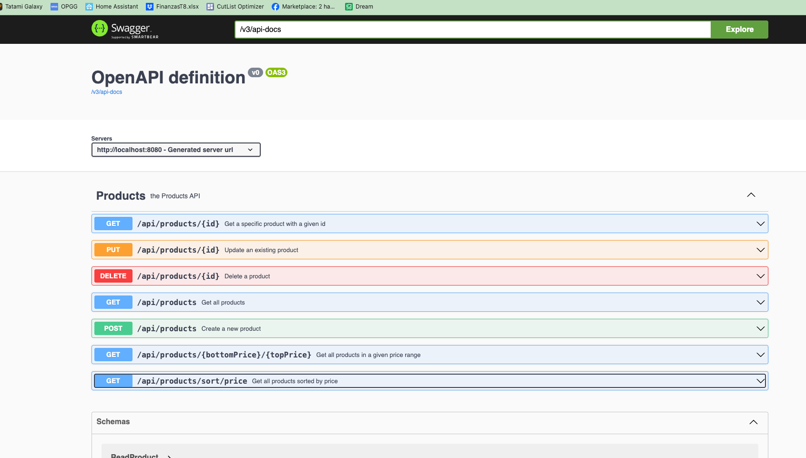

# Products API

### Reference Documentation
The present application is developed using the following tools, please, refer to the oficial pages for any additional information

* [Open Api](https://www.openapis.org/)
* [Spring boot](https://spring.io/projects/spring-boot)
* [Spring JPA](https://spring.io/projects/spring-data-jpa)

### OpenApi specification
The open-api-spec contains detailed files with the complete specification of the api developed in this application; the
code for the controllers and the delegates is being automatically generated during the Gradle build task, which allows 
me as the developer to focus only on the logic for the services. It also allows the code to be consistent all the time with 
the documentation and the specification.

### Database definition
The database tables and relations are defined automatically by the Spring JPA implementation; therefore, everything is
self documented in the Entity classes. Only for testing and evaluation process the database implemented is h2, which is
an in memory database, therefore, on each restart the application will reset the database. This can be changed by setting
a file db in the application properties file.

### Mapper interface
To avoid implementing additional boilerplate code to map between entities and DTOs the mapper capabilities of mapstruct 
has been implemented in the ProductMapper interface, this will generate a class that maps the values in the Product db
entity and the ReadProduct response class, based on the names of the fields.

### Swagger UI
The application also implements swagger as a playground to execute requests to the API as a documentation tool. This
UI can be found on http://localhost:8080/swagger-ui/index.html#/ while running the application.

### Unit and integration testing
This application is tested both on unit tests and application tests. The ProductServiceTest class includes only unit 
tests over mocked data, which is not being saved. This class only validates that the ProductService class calls its
dependencies correctly. The ProductApiIntegrationTest however instantiates the application on a full development/test
mode, and makes the requests to the server, validates that the information gets persisted and that it can be delivered
by the other endpoints. Both tests suites run as part of the gradlew build task.

### Local instantiation
This application can be run by importing it to any IDE and running it like a spring boot application or using a gradlew
wrapper file included in this repo

`./gradlew clean bootRun
`

### Functional/Manual Testing
As mentioned before, the api can be tested by accessing the swagger UI on http://localhost:8080/swagger-ui/index.html#/
however, a Postman collection is included in the _testing_ folder, based on the Open Api specification.

Thanks!